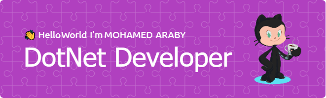

<h1 align="center">
    
</h1>
##  About me

A passionate computer science student, dot net developer, and advocate for collaborative coding communities. 🚀

🎓 I graduated from Information Technology School with a diploma degree in Computer Systems, where I honed my skills and ignited my curiosity for technology.

📚 Currently, I'm pursuing my academic journey as a Computer Science student at the Faculty of Computers and Information at Suez Canal University, where I'm delving deeper into the realm of computer science and expanding my knowledge horizons.

💻 By day, I'm a dedicated dot net developer at Powersoft Company, where I bring ideas to life through innovative software solutions and embrace the challenges of the ever-evolving tech landscape.

🌐 Outside of my professional endeavors, I serve as the General Secretary at "Devs Community," a vibrant hub where like-minded individuals come together to share insights, collaborate on projects, and foster a culture of continuous learning and growth.

🌟 My GitHub is my creative playground, where I showcase my projects, contribute to open-source initiatives, and connect with fellow developers from around the globe.

🔍 Let's connect and code the future together! Reach out to me here or find me on LinkedIn https://www.linkedin.com/in/mohamed-araby-ma7/ to collaborate on exciting projects or share ideas. Together, we can make an impact, one line of code at a time. 🌈

Skills:

<strong> Programming Languages</strong>: HTML, CSS, JavaScript, C#, Vb.net, SQL

<strong>Frameworks and Databases</strong>: Asp.net Api, Asp.net Mvc, SqlServer, Crystal Reports

<strong>Programming Concepts</strong>: OOP, Data Structures, SOLID Design Principles, REST API

<strong>Tools</strong>: Git, GitHub

<strong>Personal Skills</strong>: Research, Leadership, Team Working, Fast Learning, Adaptability, Time management,   and Organizing

<strong>Operating Systems</strong>: Windows, Linux

 

 
<!-- ##  Top Repositories

 -->

 

##  Connect with me

	
	
	
	
	

##  My Skills

###  Programming languages

 
  &emsp;

  &emsp;
  
  &emsp;
  

###  Frontend Development

 
  &emsp; 
     
  &emsp;
   
  &emsp;
  
	  &emsp;
  

###  Backend Development

&emsp;
 
 &emsp;

   &emsp;
	
   &emsp;

      
	 
                                     
	 

<!--
###  Operating Systems

  &emsp;
    
  &emsp;
    

